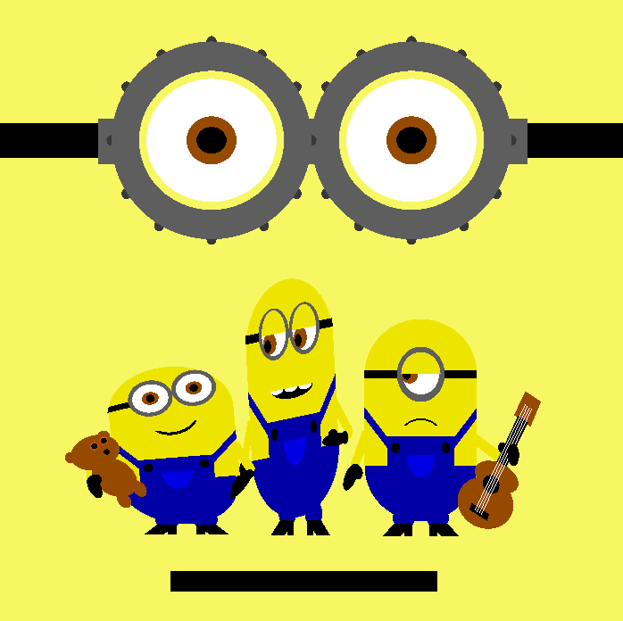
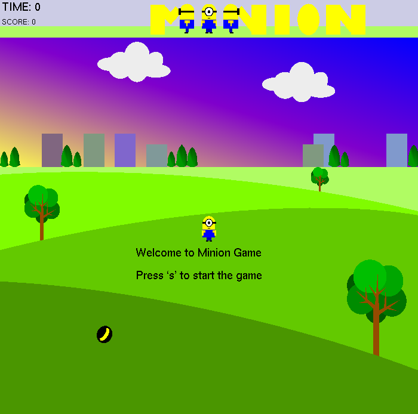
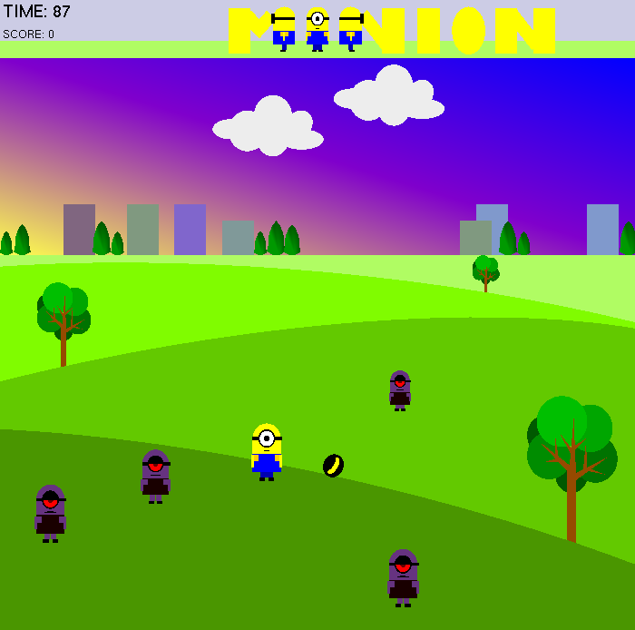

# Graphics_MinionGame

 ● A simple computer graphics 2D game using OpenGL Glut library in C++ language. 
● Created objects like minions, enemy, fruit (banana), trees, fields, clouds, and the surrounding environment using the OpenGL library. 
● Implemented functions to set a timer, show texts, and score. 
● Used keyboard functions to interact and control the game. 
● Implemented programming logic scale the minion figures according to their position in the field, update score while a minion eats a banana, recreate new banana, appearance of enemies from random directions, increase the speed of enemies with the timer, and a collision between minion and enemy.
  
Technology stack: C++, OpenGL. 

  
   
  

